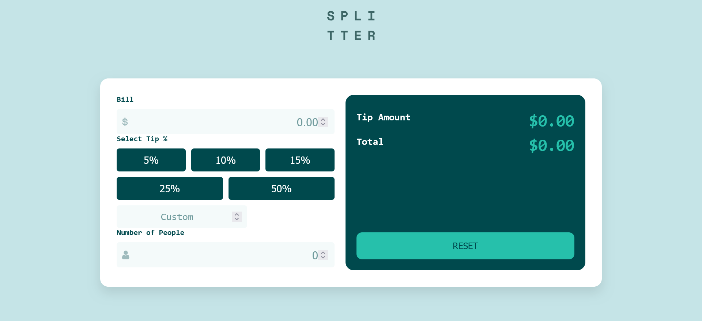

# Frontend Mentor - Tip calculator app solution

This is a solution to the [Tip calculator app challenge on Frontend Mentor](https://www.frontendmentor.io/challenges/tip-calculator-app-ugJNGbJUX). Frontend Mentor challenges help you improve your coding skills by building realistic projects.

## Table of contents

- [Overview](#overview)
  - [The challenge](#the-challenge)
  - [Screenshot](#screenshot)
  - [Links](#links)
  - [Built with](#built-with)
  - [What I learned](#what-i-learned)
  - [Continued development](#continued-development)
  - [Useful resources](#useful-resources)
- [Author](#author)
- [Acknowledgments](#acknowledgments)

## Overview

### The challenge

Users should be able to:

- View the optimal layout for the app depending on their device's screen size
- See hover states for all interactive elements on the page
- Calculate the correct tip and total cost of the bill per person

### Screenshot

### Links

- Solution URL: [https://github.com/Wisdom551-eng/Tip-calculator-app/releases/tag/v1.0.0]
- Live Site URL: [https://wisdom551-eng.github.io/Tip-calculator-app/]

## My process

### Built with

- Semantic HTML5 markup
- CSS custom properties
- Flexbox
-Javascript

### What I learned
I have learnt alot from this challenge. I got to know how to run the calculator once the user inputs the values.
for example;
---function calculateTip() {
  const bill = parseFloat(billInput.value);
  const people = parseInt(peopleInput.value);---
I have also deepened my knowledge when it comes to positioning and styling of individual contatiners.
I was happy to see how I applied div elements in this challenge;
e.g    

            

              

                <label for="bill">Bill</label>
                

       the whole assignment was just wow.

### Continued development
I will be looking forward to improving and learning more on how to make projects work automatically once a user inputs values.I have done part of this in this challenge but I feel like I still need to refine and make myself perfect.
Rest assured i would also like to dvelop my whole javascript CSS skills thus will be looking forward to projects requiring much of these.

### Useful resources

- [W3 Schools](https://www.bing.com/ck/a?!&&p=808bf04047e322615a2bd49ee309fe2ee4a752402ad2a235f9250ee69e6dac18JmltdHM9MTczNDM5MzYwMA&ptn=3&ver=2&hsh=4&fclid=1a50882b-8ebd-65a0-16ff-9cec8fbd64a5&psq=w3schools&u=a1aHR0cHM6Ly93d3cudzNzY2hvb2xzLmNvbS8&ntb=1) - This helped me for learning some more javascript. I really liked this pattern and will use it going forward.

## Author

- Website - [Wisdom Banda](https://github.com/Wisdom551-eng)
- Frontend Mentor - [@Wisdom551-eng](https://www.frontendmentor.io/home)

## Acknowledgments
I would like to thank my web development tutor(https://mzota-portfolio.onrender.com/) who helped me gaining knowledge of coding. He has been there to respond to questions and eveyrything.
